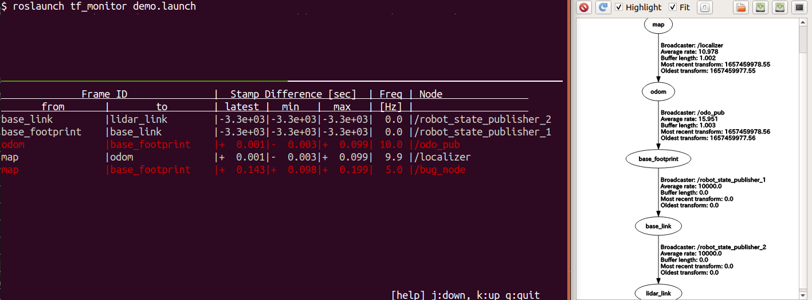

# tf_monitor

## What is this?

This is a debug tool to monitor ROS tf topic.
[Geometry2](https://wiki.ros.org/geometry2) is an ausome library to handle geometric transformations with time stamp,
and tf and tf2 is a core library of geometry2.  

When utilizing tf/tf2, the following points should be noted.

1. tf tree can have only one root frame.
1. Too old timestamp or timestamp in the future sometimes causes a defect of your robot system.

This ROS package provides a means of checking to see if any of the above problems are occurring.

## Demo

```bash
roslaunch tf_monitor demo.launch
rosrun tf_monitor tf_monitor
```



In this demo, invalid `/tf` topic is demonstrated. Although node `/odom_pub` publish `base_footprint` coordinate frame in `odom` coordinate frame, `bug_node` also publish `base_footprint` coordinate frame in `map` coordinate frame. [rqt_tf_tree](https://wiki.ros.org/rqt_tf_tree) cannot deal with these kind of problem. By `tf_monitor` we can confirm `base_footprint` have two parent frame, which is indicated by red line.

## How to build

```bash
cd /path/to/catkin_ws/src
git clone https://github.com/rkoyama1623/tf_monitor.git
rosdep install --from-path tf_monitor -iry
cd tf_monitor
catkin build --this
```

## How to use

```bash
rosrun tf_monitor tf_monitor
```

## License

MIT
